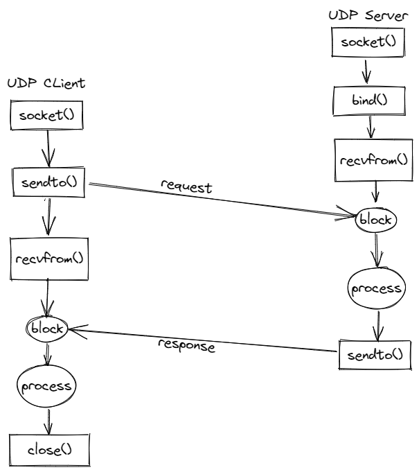

# UDP

## 概述

**UDP**是无连接，不可靠数据报协议，不同于TCP面向连接的字节流形式。UDP无需维护连接，也就没有了握手的RTT消耗，同时因为**UDP**没有要求数据包一定保持顺序，所以避免了**队头阻塞**问题。

> 队头阻塞（Head-of-line blocking, HOL blocking）是计算机网络中的一种性能受限现象。它的原因是因为一列的第一个数据包（队头）受阻，而导致整列受阻。它有可能在缓存式交换机，HTTP流水线等多个情况下出现。

一次双向的，**UDP**会话：

**UDP**的特性决定了，他天然有以下缺点：

* 无法提供可靠的字节流
* 客户端无法感知服务器的状态，仅能通过超时来判断