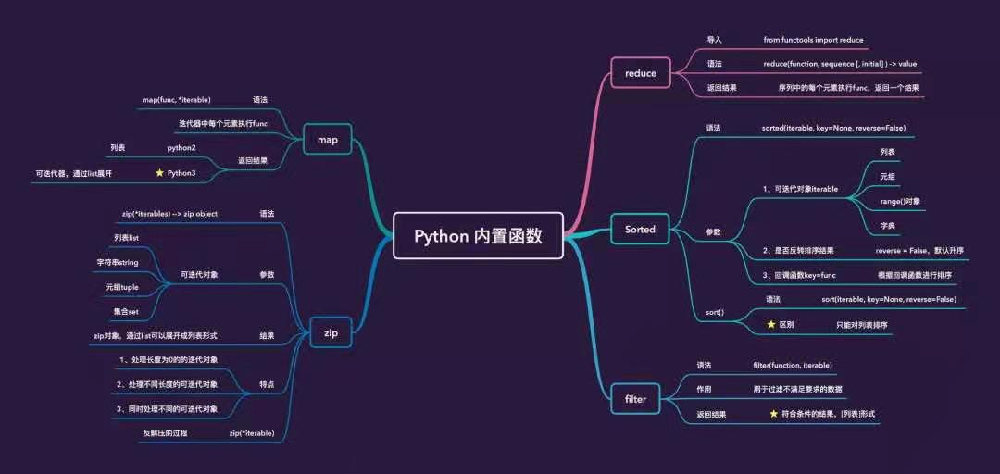

# 高阶函数总结

----



- [高阶函数总结](#高阶函数总结)
  - [1. 什么是高阶函数](#1-什么是高阶函数)
  - [2. 内建高阶函数](#2-内建高阶函数)
    - [2.1 map](#21-map)
      - [2.1.1 使用内置函数](#211-使用内置函数)
      - [2.1.2 使用lambda函数](#212-使用lambda函数)
      - [2.1.3 使用自定义函数](#213-使用自定义函数)
    - [2.2 reduce](#22-reduce)
      - [2.2.1 列表求和](#221-列表求和)
      - [2.2.2 列表展开（列表降维）](#222-列表展开列表降维)
    - [2.3 filter](#23-filter)
      - [2.3.1 按条件过滤元素](#231-按条件过滤元素)
    - [2.4 sorted](#24-sorted)
      - [2.4.1 按条件排序](#241-按条件排序)
    - [2.5 zip](#25-zip)
      - [2.5.1 列表对应](#251-列表对应)
      - [2.5.2 求集合调用函数](#252-求集合调用函数)
  - [3. 自定义高阶函数](#3-自定义高阶函数)

## 1. 什么是高阶函数

**高阶函数** 是接收函数作为参数或返回值的函数，是函数式编程的重要组成。类似`C++`标准库`STL`中提供了一系列算法。

**用于对数据结构的一系列操作函数**，因为它们都可以接受一个函数作为参数，所以称之为高阶函数。

## 2. 内建高阶函数

### 2.1 map

`map`函数的语法是`map(func, seq)`, 其含义是：对`seq`中可迭代序列中的每个元素执行前面`func`的功能，最终获得一个新的序列。

* `python2` 直接返回的是列表
* `python3` 返回的是可迭代器，想返回列表要用`list()`处理

#### 2.1.1 使用内置函数

```python
#!/usr/bin/python3

a = [1,2, -3, -5]
m = map(abs, a)
print(a)   # out: [1, 2, 3, 5]
print(list(m)) # out: [1, 2, -3, -5]
```

#### 2.1.2 使用lambda函数

```python
#!/usr/bin/python3

a = [1,2, -3, -5]
m = map(lambda x: x*x, a)
print(list(m))  # out: [1, 4, 9, 25]
```

#### 2.1.3 使用自定义函数

```python
#!/usr/bin/python3

def say(x):
    return "say" + str(x)

a = [1,2,3,4,5]
print(list(map(say, a)))
# out: ['say1', 'say2', 'say3', 'say4', 'say5']
```

### 2.2 reduce

`reduce` 函数定义`reduce(f, seq, [, inital])`。

`reduce`依次从`seq`中取一个元素，和上一次`f`调用结果作为参数，再次调用`f`。

> 如果`inital`有值，会用`seq`第一个元素和`inital`作为参数调用，否则会以`seq`第一个参数和第二个参数作为调用
> python3中，将`reduce`移动到了`functools`模块中

#### 2.2.1 列表求和

```
#!/usr/bin/python3

from functools import reduce

a = [1,2,3,4,5,6]
r = reduce(lambda x,y: x+y, a)
print(r)
# out: 21
```

#### 2.2.2 列表展开（列表降维）

```
#!/usr/bin/python3

from functools import reduce

a = [[1,2],[3,4],[5,6]]
r = reduce(lambda x,y: x+y, a)
print(r)
```

### 2.3 filter

`filter`函数定义`filter(f, iterable)`，用于过滤序列，过滤掉不符合条件的那些元素，返回符合条件的元素组成新的序列。

用每个元素传递给`f`，判断返回的`True or Flase`，过滤成为新列表。

#### 2.3.1 按条件过滤元素

```python
#!/usr/bin/python3

from functools import reduce

a = [1,2,-1,-2]
f = filter(lambda x: x >0, a)
print(list(f))
```

### 2.4 sorted

`sorted`定义`sorted(iterable, key=None, reverse=False)`。

* `iterable` 迭代序列
* `reverse=False` 是否反转排序结果，默认不反转
* `key=None` 回调函数传入，只能有一个参数，使用返回值进行排序

> `sort`函数与`sorted`函数基本一致，唯一不同是，`sort`在原列表排序修改，`sorted`返回一个新的列表

#### 2.4.1 按条件排序

```
#!/usr/bin/python3

a = [1,2,-1,-2]
print(sorted(a))
# out: [-2, -1, 1, 2]
print(sorted(a, key=abs))
# out: [1, -1, 2, -2]
```

### 2.5 zip

`zip`函数定义`zip([iterable,...])`, 将列表中多个可迭代对象合并成元组，`python3`返回的是`zip.Ojbect`, `python2`返回列表。

#### 2.5.1 列表对应

```python
#!/usr/bin/python3

a = [1,2,-1,-2]
b = [1,-1]
print(list(zip(a,b)))
# out: [(1, 1), (2, -1)]
```

元素数目不一致的时候，会取短

#### 2.5.2 求集合调用函数

```python
#!/usr/bin/python3

def say(a,b):
    return a+b

a = "pythonaa"
b = "pythonbbbbb"

for n in zip(a,b):
    print(say(*n))

# out: pp ...
```

## 3. 自定义高阶函数

自定义一个高阶函数非常简单，只需要简单将函数作为**参数**:

```python
def tony(f, a):
    return f(a)
```

或作为**返回值**:

```
def pony():
    def _gg(x):
        return x + 1
    return _gg
```

再利用python函数的动态参数属性`func(*args,**kwargs)` 返回`tuple`或`dict`作为结果，再嵌套，就可以实现一个**函数式编程**的实例：

```python
#!/usr/bin/python3

def pony():
    def _gg(x):
        return x + 1
    return _gg

def tony(f, a):
    return f(a)

def haha():
    return (pony(), 2)

def main():

    print(tony(*haha()))

if __name__ == "__main__":
    main()
```

> *args，函数参数前带 `*` 解元组作为参数
> *kwargs, 函数参数前带 `**` 解字典作为参数
